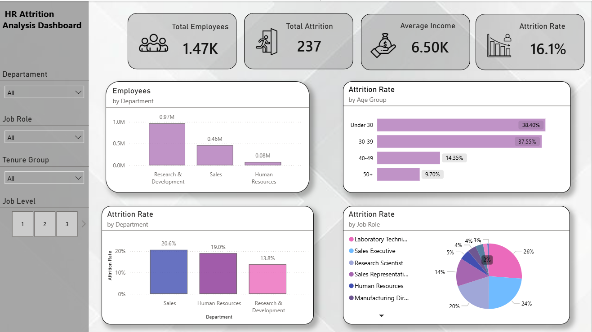
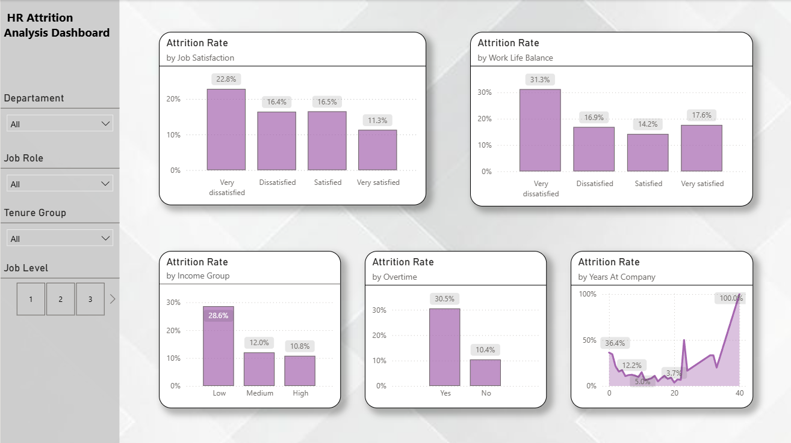

HR Attrition Analytics Dashboard

This project analyses employee attrition using HR data to identify key drivers of workforce turnover.
________________________________________
Overview

• Total employees: 1470

• Attrition (employees who left the company): 237

• Attrition rate (Attrition / Total employees × 100): 16%

• Average monthly income (Total income / Total employees): 6,500

The dataset represents a snapshot of the workforce and does not include a time dimension, meaning attrition cannot be analysed over time.

________________________________________

Key Insights

1. Department Analysis

Attrition is relatively balanced across departments: Sales accounts for 20% and Human Resources for 19%, while Research and Development shows the lowest rate at 13.8%.

2. Job Role & Experience
 
Sales Representatives show the highest attrition rate (42.1%), with a large proportion of employees under 30 years old (55%), suggesting higher turnover in entry-level positions. Managers and Directors (typically 40+ years old) show the lowest attrition rates.
Within the Research and Development department, Laboratory Technicians account for the highest share of attrition (23.9%), with 63.6% having one year or less tenure in the company. Additionally, 50% of this role works overtime and 50% are under 30 years old.

3. Age Distribution

Employees under 30 exhibit the highest attrition rates (38.4%), reinforcing the pattern of higher turnover among early-career professionals.

4. Job Satisfaction

Lower levels of job satisfaction (39.2% in the [(very) dissatisfied] group) are associated with higher attrition, suggesting that employee engagement may play an important role in retention.

6. Work-Life Balance

Despite moderate overall work-life balance levels (with 48.2% reporting being [(very) dissatisfied]), attrition remains significant, suggesting that work-life balance may help explain employee turnover, but is not the sole driver.

7. Tenure
   
Attrition is highest during the early tenure period (0–5 years), with a significant decline after 10 years, suggesting that employees who remain longer tend to be more stable and engaged.

8. Income

Lower salary groups show higher attrition rates (28.6%), suggesting that compensation may influence employee retention.
________________________________________
Conclusion
The data reveals an important pattern across entry-level roles (Job Level 1). While the average salary is relatively similar for entry-level positions (e.g., 2.79k), attrition rates vary significantly by role. Laboratory Technicians have an average salary of 2.85k with 28% attrition, whereas Sales Representatives earn a lower average salary of 2.53k but show the highest attrition rate at 42%.
This suggests that compensation alone does not fully explain turnover. For Sales Representatives, improving entry-level salary levels may help reduce attrition, while for Laboratory Technicians, non-monetary factors such as working conditions and job environment are likely more important drivers of retention.

## 📊 KPI Overview

This section presents the main HR metrics, including total employees, attrition rate, attrition count, and average income.

---

## 🔍 Attrition Analysis Dashboard

This dashboard explores the key drivers of employee attrition, including overtime, job satisfaction, work-life balance, income groups, and tenure.

